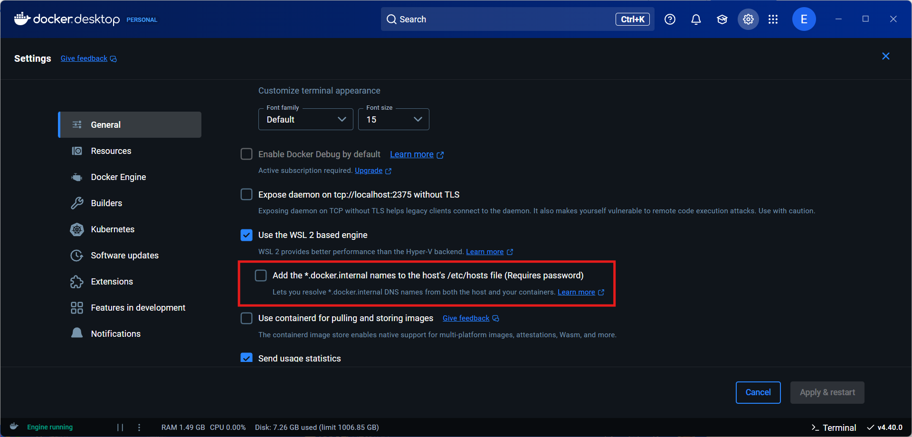

# example-spring-boot-mysql-timestamp-to-datetime-app

## Table of Contents

<!-- TOC -->
* [example-spring-boot-mysql-timestamp-to-datetime-app](#example-spring-boot-mysql-timestamp-to-datetime-app)
  * [Table of Contents](#table-of-contents)
  * [Description](#description)
  * [Motivation](#motivation)
  * [Helpful Documentation](#helpful-documentation)
  * [Prerequisites](#prerequisites)
  * [Starting the Application (Local)](#starting-the-application-local)
    * [Manually Starting the Application](#manually-starting-the-application)
  * [Troubleshooting](#troubleshooting)
    * [Unable to Obtain Database Connection](#unable-to-obtain-database-connection)

<!-- TOC -->

## Description

This is a simple Spring Boot application that demonstrates how to convert a MySQL `TIMESTAMP` column to a MySQL
`DATETIME` column. This is done on identical tables, but with different Java data types for the date-time columns.

The classes can be found at [src/main/java/com/mrlonis/time/entity](./src/main/java/com/mrlonis/time/entity/package-info.java).

What is interesting to note, is that regardless of the underlying MySQL column type, the Java data type used in the
Spring Boot application is the same. This is because the MySQL JDBC driver handles the conversion between the
data types.

## Motivation

The motivation for this project is to demonstrate how to convert a MySQL `TIMESTAMP` column to a MySQL `DATETIME` to
avoid the MySQL `TIMESTAMP` column type's limitation of only being able to store dates in the range of
`1970-01-01 00:00:01 UTC` to `2038-01-19 03:14:07 UTC`.

This is a problem for applications that need to store dates outside of this range, such as historical data or future
dates. The `DATETIME` column type does not have this limitation and can store dates from `1000-01-01 00:00:00` to
`9999-12-31 23:59:59`.

## Helpful Documentation

- [Improved Testcontainers Support in Spring Boot 3.1](https://spring.io/blog/2023/06/23/improved-testcontainers-support-in-spring-boot-3-1)
- [Support for Date-Time Types in Connector/J 8.0](https://dev.mysql.com/blog-archive/support-for-date-time-types-in-connector-j-8-0/)

## Prerequisites

- Java: 21
  - Mac-OS: `brew install --cask temurin@21`
  - Windows: `choco install temurin21`
- Maven: 3.9.9
  - Mac-OS: `brew install maven`
  - Windows: `choco install maven`
  - Alternative: Maven Wrapper (`./mvnw`)

## Starting the Application (Local)

Run the following command to start the application locally:

```bash
./mvnw spring-boot:run -Dspring-boot.run.profiles=local
```

This will start the application and automatically configure the database needed via the [compose.yaml](./compose.yaml)
file.

### Manually Starting the Application

1. Start the MySQL database using Docker:

   ```bash
   docker compose up -D
   ```
2. Run the following command to start the application:

   ```bash
   ./mvnw spring-boot:run -Dspring-boot.run.profiles=local
   ```

**Note:** Notice the only difference is we are manually setting up the same docker database here, just manually
ourselves rather than via the Spring Boot docker integration.

## Troubleshooting

### Unable to Obtain Database Connection

If you receive an error similar to the
following: [https://stackoverflow.com/questions/64101683/spring-boot-unable-to-communicate-with-mysql-db-in-docker-environment](https://stackoverflow.com/questions/64101683/spring-boot-unable-to-communicate-with-mysql-db-in-docker-environment),
then you may need edit your `/etc/hosts` file.

Solution: [https://stackoverflow.com/questions/72346784/docker-is-inaccessible-on-localhost-but-works-fine-on-127-0-0-1](https://stackoverflow.com/questions/72346784/docker-is-inaccessible-on-localhost-but-works-fine-on-127-0-0-1)

The issue stems from the enabling of the
`Add the *.docker.internal names to the host's /etc/hosts file (Requires password)` [Docker Desktop](https://www.docker.com/products/docker-desktop/)
setting on Windows.



If you ever enabled this setting, you will need to disable it and **manually** edit your `/etc/hosts` file to remove the
`*.docker.internal` entries.

On windows, open the `%SystemRoot%\System32\drivers\etc\hosts` file in a text editor with elevated privileges. It will
look something like the file below:

```plain text
# Copyright (c) 1993-2009 Microsoft Corp.
#
# This is a sample HOSTS file used by Microsoft TCP/IP for Windows.
#
# This file contains the mappings of IP addresses to host names. Each
# entry should be kept on an individual line. The IP address should
# be placed in the first column followed by the corresponding host name.
# The IP address and the host name should be separated by at least one
# space.
#
# Additionally, comments (such as these) may be inserted on individual
# lines or following the machine name denoted by a '#' symbol.
#
# For example:
#
#      102.54.94.97     rhino.acme.com          # source server
#       38.25.63.10     x.acme.com              # x client host

# localhost name resolution is handled within DNS itself.
#	127.0.0.1       localhost
#	::1             localhost
# Added by Docker Desktop
192.168.4.126 host.docker.internal
192.168.4.126 gateway.docker.internal
# To allow the same kube context to work on the host and the container:
127.0.0.1 kubernetes.docker.internal
# End of section
```

Notice the `# Added by Docker Desktop` section. You will need to remove this section **or** comment it out by adding a
`# ` to each line. Unchecking the setting in Docker Desktop will **NOT** remove this section from your `/etc/hosts`
file.
You will need to remove it manually **AND** restart your machine for the changes to take effect.
